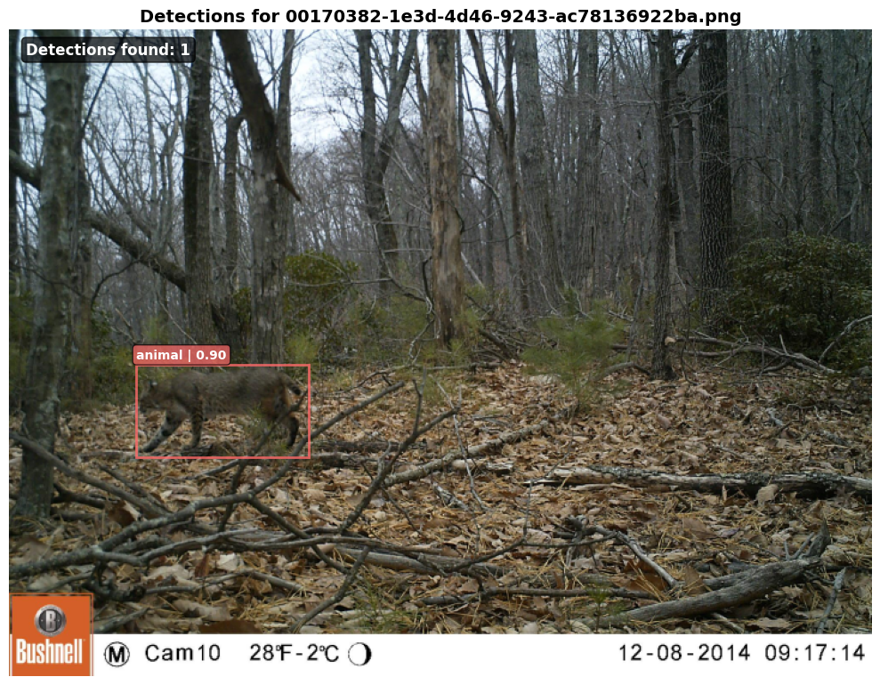

# Animal Detection Guide

This guide covers how to perform animal detection on large image datasets using MegaDetector[^1] [^2]. MegaDetector is specifically trained for wildlife camera trap images.

[^1]: Beery, S., Morris, D., & Yang, S. MegaDetector. GitHub repository: https://github.com/agentmorris/MegaDetector

[^2]: Microsoft AI for Earth. CameraTraps: Tools for training and running detectors and classifiers for wildlife camera trap images. GitHub repository: https://github.com/microsoft/CameraTraps

## Overview

The animal detection module provides high-performance batch processing of images for wildlife detection using MegaDetector. It's designed for HPC environments with GPU acceleration and distributed processing capabilities.

### Key Features

- **MegaDetector Support**: Optimized for Microsoft's MegaDetector models (specifically designed for wildlife camera trap images)
- **Multiple Input Types**: Process image directories or Parquet datasets
- **Distributed Processing**: Multi-GPU and multi-node support via SLURM
- **Efficient Data Pipeline**: Optimized data loading with prefetching and parallel processing
- **Comprehensive Output**: Detailed detection results with confidence scores and bounding boxes
- **Performance Monitoring**: Built-in profiling and resource usage tracking

## Quick Start

Create a working directory at home directory and change current directory. 

```bash
mkdir ~/animal_detection
cd ~/animal_detection
```

### Install Dependency

First, follow the [Getting Started guide](getting-started.md) to set up your environment and install the base `hpc-inference` package.

Once you have the base installation, install the detection-specific dependencies:

```bash
# Activate your virtual environment
source ~/venvs/hpc_inference/bin/activate

# Install detection dependencies
uv pip install "hpc-inference[detection]"
```
This will install additional packages required for animal detection.

### Download Example Data

The **ENA24 Detection Dataset**[^3] is a wildlife camera trap dataset collected from Estonia across multiple sites. The dataset was created as part of the Efficient Neural Architecture Design (ENA24) detection challenge and features diverse wildlife species in natural forest environments. For this guide, we use the **balanced subset** available on [Hugging Face](https://huggingface.co/datasets/imageomics/IDLE-OO-Camera-Traps), which provides a curated selection of 1,120 high-quality images with improved class distribution.

[^3]: Yousif H, Kays R, Zhihai H. Dynamic Programming Selection of Object Proposals for Sequence-Level Animal Species Classification in the Wild. IEEE Transactions on Circuits and Systems for Video Technology, 2019.

=== "Python"

    ```python
    from pathlib import Path
    from huggingface_hub import snapshot_download

    # Download the ENA24 subset (~1GB)
    data_dir = "~/animal_detection/camera_trap_data"

    snapshot_download(
        repo_id="imageomics/IDLE-OO-Camera-Traps",
        repo_type="dataset",
        local_dir=data_dir,
        allow_patterns=["data/test/ENA24/*"]
    )

    # Set up paths  
    image_dir = Path(data_dir) / "data/test/ENA24"
    print(f"Dataset downloaded to: {image_dir}")
    print(f"Number of images: {len(list(image_dir.glob('*.png')))}")
    ```

=== "Bash"

    ```bash
    # Install huggingface_hub if not already installed
    # pip install huggingface_hub

    # Download only the ENA24 subset
    huggingface-cli download imageomics/IDLE-OO-Camera-Traps \
        --repo-type dataset \
        --local-dir ~/animal_detection/camera_trap_data \
        --include "data/test/ENA24/*"

    # Verify download
    echo "Dataset downloaded to: camera_trap_data/data/test/ENA24"
    echo "Number of images: $(find ~/animal_detection/camera_trap_data -name '*.png' -o -name '*.PNG' | wc -l)"
    ```

### Download Model Weights

Check out the [Model Zoo](https://microsoft.github.io/CameraTraps/model_zoo/megadetector/) to compare different Megadetector model releases. In this post, we'll use the most capable model `MDV6-yolov10-e`. 

```bash
cd ~/animal_detection
mkdir -p model/megadetector
wget -O model/megadetector/MDV6-yolov10-e-1280.pt "https://zenodo.org/records/15398270/files/MDV6-yolov10-e-1280.pt?download=1"
```

**MegaDetector Class Categories:**

- `0`: Animal
- `1`: Person
- `2`: Vehicle


### Basic Usage

Let's perform face detection inference using `MDV6-yolov10-e`. We'll specify the target & output directory, input types & model weights location. Please make sure your machine has GPU available when you run this example.

```bash
# Using command line arguments
python -m hpc_inference.inference.detection.animal_detect \
    $HOME/animal_detection/camera_trap_data/data/test/ENA24 \
    $HOME/animal_detection/detection \
    --input_type images \
    --model_weights "$HOME/animal_detection/model/megadetector/MDV6-yolov10-e-1280.pt"
```

Check detection output:
```bash
tree $HOME/animal_detection/detection
```
```
animal_detection/detection
├── detections
│   └── rank_0
│       └── animal_detection_results_rank_0_0.parquet
└── profile_results
    └── rank_0
        ├── computing_specs.json
        ├── cpu_gpu_usage_plot.png
        ├── gpu_mem_usage_plot.png
        ├── profile_log.csv
        └── usage_log.csv
```

We'll go through script arguments and detection output in details in the following section. 


## Input Data Requirements

### Image Directory Structure

The script supports flexible directory structures:

**Flat Structure:**
```
/images/
├── image001.jpg
├── image002.png
└── image003.jpeg
```

**Nested Structure:**
```
/images/
├── category1/
│   ├── img1.jpg
│   └── img2.png
└── category2/
    ├── img3.jpg
    └── img4.png
```

**Supported Image Formats:**

- JPEG (.jpg, .jpeg)
- PNG (.png)
- BMP (.bmp)
- TIFF (.tif, .tiff)
- WebP (.webp)

All images are automatically converted to RGB mode for processing.

### Parquet Input

The module can also process compressed parquet image dataset. 

```bash
python -m hpc_inference.inference.detection.animal_detect \
    /path/to/parquet/files \
    /path/to/output \
    --input_type parquet \
    --config your_config.yaml
```
Learn more about the parquet file specific configuration in the config section. 

## Configuration

### Using Configuration Files (Recommended)

Configuration files provide better reproducibility and easier parameter management. 

You can find documented template for config specification in `configs/animal_detection`

<details>
<summary>Image Folder Dataset Config Template</summary>
</br>

{{ include_file_as_code("configs/animal_detection/config_animal_detect_image_folder_template.yaml", "yaml") }}

</details>

<details>
<summary>Parquet Image Dataset Config Template</summary>
</br>

{{ include_file_as_code("configs/animal_detection/config_animal_detect_parquet_template.yaml", "yaml") }}

</details>


#### Model Configuration
```yaml
model:
  weights: MDV6-yolov10-e-1280.pt  # MegaDetector model weights location
```

#### Detection Parameters
```yaml
confidence_threshold: 0.2  # Minimum confidence for detections
image_size: 1280          # Input image size (square format)
```

#### Performance Settings
```yaml
batch_size: 16        # Images per batch (adjust for GPU memory)
num_workers: 20       # Data loading workers
prefetch_factor: 8    # Prefetch batches per worker
```

#### Image Processing
```yaml
validate_images: false  # Validate images with PIL (slower but safer)
uuid_mode: filename    # How to generate unique IDs
evenly_distribute: true # Balance load across workers
```

### UUID Generation Modes

Control how unique identifiers are generated for images:

- **`filename`**: `image001.jpg` - Good for flat directories
- **`relative`**: `subfolder/image001.jpg` - Good for nested directories
- **`fullpath`**: `/full/path/to/image001.jpg` - Full traceability
- **`hash`**: MD5 hash of path - Anonymous IDs


## HPC/SLURM Usage

If you are working on HPC, you can use the SLURM templates in `scripts/animal_detection` to schedule batch detection jobs and potentially scale across multiple GPUs. 

<details>
<summary>Image Folder Dataset SLURM Template</summary>
</br>

{{ include_file_as_code("scripts/animal_detection/animal_detect_image_folder_template.slurm", "slurm") }}

</details>

<details>
<summary>Parquet Image Dataset SLURM Template</summary>
</br>

{{ include_file_as_code("scripts/animal_detection/animal_detect_parquet_template.slurm", "slurm") }}

</details>

### Single Process Job

Let's create a config file and submit the detection task as a SLURM job using one GPU.

Create a `config` folder and an empty config file:
```bash
cd ~/animal_detection
mkdir configs
nano configs/animal_detect_config.yaml
```
Paste the content below to `configs/animal_detect_config.yaml`
```yaml
model:
    weights: model/megadetector/MDV6-yolov10-e-1280.pt # Use absolute path if possible

confidence_threshold: 0.2
image_size: 1280

batch_size: 16
num_workers: 20
prefetch_factor: 8

validate_images: true
uuid_mode: filename
evenly_distribute: true
```

Now create a `log` directory to store job logs
```bash
mkdir -p ~/animal_detection/logs
```

Save and exit (in nano: `Ctrl+X`, then `Y`, then `Enter`). Check the file was created correctly
```bash
cat ~/animal_detection/configs/animal_detect_config.yaml
```
Now create a `scripts` folder and an empty SLURM script
```bash
cd ~/animal_detection
mkdir scripts
nano scripts/animal_detect_single_process.slurm
```
Paste the content below to `configs/animal_detect_config.yaml`. Make sure to replace the `partition` & `account` based on your HPC credentials. Also replace the virtual environment placeholder with the absolute path to your virtual environment. 
```bash
#!/bin/bash
#SBATCH --job-name=animal_detect_single_process
#SBATCH --nodes=1
#SBATCH --ntasks-per-node=1 
#SBATCH --gpus-per-task=1
#SBATCH --cpus-per-task=48
#SBATCH --partition=YOUR_CLUSTER_PARTITION
#SBATCH --time=00:10:00
#SBATCH --output=logs/animal_detect_single_process_%j.out
#SBATCH --error=logs/animal_detect_single_process_%j.err
#SBATCH --account=YOUR_ACCOUNT_NUMBER

module load cuda/12.4.1
source PATH/TO/YOUR/VENV/bin/activate

TARGET_DIR="$HOME/animal_detection/camera_trap_data/data/test/ENA24"
OUTPUT_DIR="$HOME/animal_detection/detection_single_process"
CONFIG_FILE="$HOME/animal_detection/configs/animal_detect_config.yaml"


srun python -m hpc_inference.inference.detection.animal_detect \
    "${TARGET_DIR}" \
    "${OUTPUT_DIR}" \
    --input_type images \
    --config "${CONFIG_FILE}" 
```
Save and exit (in nano: `Ctrl+X`, then `Y`, then `Enter`). Check the file was created correctly
```bash
cat ~/animal_detection/scripts/animal_detect_single_process.slurm
```
Using this SLURM script, we'll perform the inference pipeline on **one** compute node allocated with 1 GPU & 48 CPUs. Now let's submit the SLURM job

```bash
cd ~/animal_detetction
sbatch scripts/animal_detect_single_process.slurm
```

### Multi-processes Distributed Processing

For large-scale datasets containing millions of images, you should scale by increasing the number of processes. Depending on your computing resource, this could be done in several ways:

**Multiple GPUs per Node**

If your nodes have multiple GPUs and sufficient CPU cores:

```bash
#SBATCH --nodes=1
#SBATCH --ntasks-per-node=2    # 2 processes per node
#SBATCH --gpus-per-task=1      # 1 GPU per process
#SBATCH --cpus-per-task=48     # 48 CPU per process
```

**Multiple Nodes**

If you only have one GPU per node or don't have enough CPUs for each process, you can simply increase the number of nodes

```bash
#SBATCH --nodes=4              # 4 nodes total
#SBATCH --ntasks-per-node=1    # 1 process per node
#SBATCH --gpus-per-task=1      # 1 GPU per process
#SBATCH --cpus-per-task=48     # Full node resources
```

Let's create a multi-processes SLURM job script by increasing the number nodes:
```bash
nano scripts/animal_detect_multi_processes.slurm
```
```bash
#!/bin/bash
#SBATCH --job-name=animal_detect_multi_processes
#SBATCH --nodes=4    
#SBATCH --ntasks-per-node=1 
#SBATCH --gpus-per-task=1
#SBATCH --cpus-per-task=48
#SBATCH --partition=YOUR_CLUSTER_PARTITION
#SBATCH --time=00:10:00
#SBATCH --output=logs/animal_detect_multi_processes%j.out
#SBATCH --error=logs/animal_detect_multi_processes%j.err
#SBATCH --account=YOUR_ACCOUNT_NUMBER

module load cuda/12.4.1
source PATH/TO/YOUR/VENV/bin/activate

TARGET_DIR="$HOME/animal_detection/camera_trap_data/data/test/ENA24"
OUTPUT_DIR="$HOME/animal_detection/detection_multi_processes"
CONFIG_FILE="$HOME/animal_detection/configs/animal_detect_config.yaml"


srun python -m hpc_inference.inference.detection.animal_detect \
    "${TARGET_DIR}" \
    "${OUTPUT_DIR}" \
    --input_type images \
    --config "${CONFIG_FILE}" 
```
Using this SLURM script, we'll perform the inference pipeline on **4** compute nodes allocated with 1 GPU & 48 CPUs per node. Now let's submit the SLURM job

```bash
cd ~/animal_detetction
sbatch scripts/animal_detect_multi_processes.slurm
```


## Output Format

### Directory Structure

Here's the example output directory structure for single-process detection.
```
output_dir/
├── detections/
│   └── rank_0/
│       ├── animal_detection_results_rank_0_0.parquet
│       ├── animal_detection_results_rank_0_1.parquet
│       └── ...
│       └── animal_detection_results_rank_0_n.parquet
└── profile_results/
    └── rank_0/
        ├── computing_specs.json
        ├── cpu_gpu_usage_plot.png
        ├── gpu_mem_usage_plot.png
        ├── profile_log.csv
        └── usage_log.csv
```
For multiple-processes jobs, we'll simply see more ranks, where the files within stays consistent:
```
output_dir/
├── detections/
│   └── rank_0/
│   └── ...
│   └── rank_n/
└── profile_results/
│   └── rank_0/
│   └── ...
│   └── rank_n/
```

### Detection Results Schema

Each Parquet file contains detection results with these columns:

| Column | Type | Description |
|--------|------|-------------|
| `uuid` | String | Unique identifier for each image |
| `max_detection_score` | Float | Maximum confidence score across all detections (0.0 if no animals detected) |
| `num_detections` | Integer | Total number of detections above threshold |
| `detections` | JSON String | Detailed detection information for each detected object |

Each detection object in the JSON includes:
```json
{
  "bbox": [x1, y1, x2, y2],          // Absolute pixel coordinates
  "bbox_normalized": [x1, y1, x2, y2], // Normalized coordinates (0-1)
  "confidence": 0.85,                 // Detection confidence score
  "class_id": 0,                     // Numeric class ID
  "class_name": "animal"             // Human-readable class name
}
```

### Example Output

```python
import pandas as pd
import json

# Load results
df = pd.read_parquet("~/animal_detection/detection/detections/rank_0/animal_detection_results_rank_0_0.parquet")

# View summary
print(f"Processed {len(df)} images")
print(f"Found animals in {sum(df['num_detections'] > 0)} images")
print(f"Average detections per image: {df['num_detections'].mean():.2f}")
```
```
Processed 1120 images
Found animals in 1116 images
Average detections per image: 1.10
```
```python
# Parse detections for first image with animals
first_detection = df[df['num_detections'] > 0].iloc[0]
detections = json.loads(first_detection['detections'])
print(f"Image {first_detection['uuid']} has {len(detections)} detections:")
for detection in detections:
    print(f"  {detection['class_name']}: {detection['confidence']:.3f}")
```
```
[{'bbox': [188.17922973632812,
   656.734619140625,
   443.3848876953125,
   794.3240966796875],
  'bbox_normalized': [0.14701502323150634,
   0.5130739212036133,
   0.3463944435119629,
   0.6205657005310059],
  'confidence': 0.8981033563613892,
  'class_id': 0,
  'class_name': 'animal'}]
```

Megadetector detected one animal with high confident 0.8981. Let's use the utility function to plot the detection box on top of the original image to validate the detection result:

```python
from hpc_inference.utils.visualization import plot_detections_matplotlib

image_uuid = first_detection['uuid']
image_path = f"camera_trap_data/data/test/ENA24/{image_uuid}"

image = Image.open(image_path)
detections = json.loads(first_detection['detections'])

plot_detections_matplotlib(
    image, detections,
    letterbox_shape=(1280, 1280),
    title=f"Detections for {image_uuid}"
)
```


!!!note
    Notice we specified `letterbox_shape=(1280, 1280)` for the `letterbox_shape` argument. This matches the default `image_size: 1280` used during preprocessing for MegaDetector in our script. 
    
    Always keep track of the preprocessing image size and specify the same dimensions when plotting detection boxes on the original image to ensure accurate bounding box positioning.


## Performance Optimization & Troubleshooting

### Common Issues & Solutions

#### **GPU Memory Issues**

**Symptoms:**

- CUDA out of memory errors
- Sudden job termination
- GPU memory warnings

**Solutions:**
```yaml
# Reduce GPU memory usage
batch_size: 8          # Start small and increase gradually
image_size: 1024       # Use smaller input size
```

- Monitor GPU usage: `nvidia-smi` during processing
- Check profile results after job completion for memory patterns

#### **CPU/DataLoader OOM Crashes**

**Symptoms:**

- Workers being killed during data loading
- "DataLoader worker (pid XXXX) is killed by signal" errors
- Job hangs during data preprocessing

**Solutions:**
```yaml
# Reduce memory pressure in data loading
num_workers: 8         # Fewer parallel workers
prefetch_factor: 2     # Less prefetching
evenly_distribute: true # Better load balancing
```

If possible, use more processors to reduce the risk of OOM crashing. 
```bash
#SBATCH --ntasks-per-node=64  # Use 64 cores per task, increase RAM
```


#### **Model Loading Errors**

**Symptoms:**

- "Model file not found" errors
- CUDA compatibility issues
- Ultralytics import errors

**Solutions:**

- Verify model weights file exists and is accessible
- Check CUDA version compatibility
- Ensure dependencies
- Pre-download models to avoid network issues during job execution

#### **Detection Quality Issues**

**Symptoms:**

- Too many false positives
- Missing obvious animals
- Poor detection accuracy

**Tuning Parameters:**
```yaml
# Balance quality vs speed
confidence_threshold: 0.6  # Increase the threshold for positive detection -> increase precision
image_size: 1280           # Higher resolution for better accuracy
model:
  weights: MDV6-yolov10-e-1280.pt  # Better model
```

**Quality vs Speed Trade-offs:**

- **Higher confidence_threshold**: Fewer false positives, may miss some animals
- **Lower confidence_threshold**: More detections, high recall but more false positives
- **Larger image_size**: Better accuracy, slower processing
- **Smaller image_size**: Faster processing, may miss small animals

### Performance Monitoring & Best Practices

**Built-in Monitoring:**

- **Real-time logging**: Progress updates and throughput metrics
- **Performance profiles**: Detailed timing analysis in `profile_results/`
- **Resource tracking**: CPU, GPU, and memory utilization plots
- **Batch statistics**: Per-batch timing and detection counts

**Optimization Workflow:**

1. **Start small**: Test with 100-1000 images first
2. **Monitor resources**: Watch GPU/CPU utilization during test run
3. **Analyze profiles**: Check `profile_results/` for bottlenecks
4. **Tune parameters**: Adjust based on resource utilization
5. **Scale up**: Apply successful settings to full dataset

**Configuration Management:**

- **Save working configs**: Keep track of successful parameter combinations
- **Version control**: Use git to track configuration changes
- **Document settings**: Note dataset-specific optimizations

