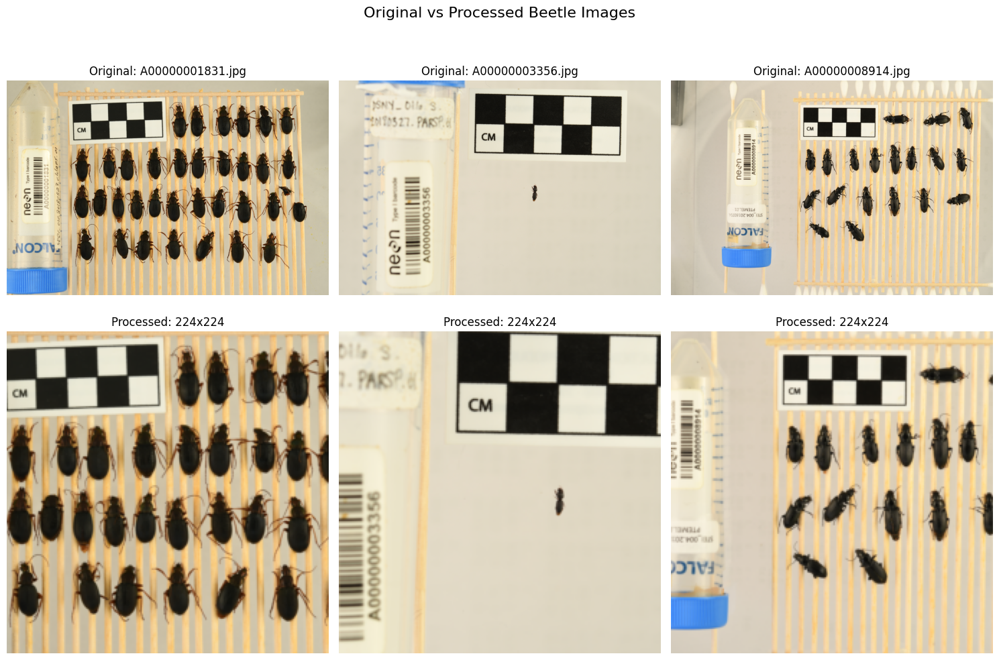

# ImageFolderDataset Guide: Working with NEON Beetle Images

This guide demonstrates how to use the [`ImageFolderDataset`](api-reference.md#hpc_inference.datasets.ImageFolderDataset) class from the HPC Inference package with the [2018 NEON Beetles dataset](https://huggingface.co/datasets/imageomics/2018-NEON-beetles).

## Overview

The [`ImageFolderDataset`](api-reference.md#hpc_inference.datasets.ImageFolderDataset) is designed for efficient streaming of large image collections, with support for:

- **Distributed processing** across multiple workers/ranks
- **Multiple preprocessing pipelines** for different models
- **Flexible UUID generation** from file paths
- **Image validation** using PIL
- **Memory-efficient streaming** for large datasets

## Dataset Overview

The 2018 NEON Beetles dataset contains:
- 577 high-resolution group images of ethanol-preserved beetles
- Beetles collected from NEON ecological sites in 2018
- Multiple beetles per image, organized by species
- Rich metadata including species labels, site information, and measurements

We'll work with the `group_images` folder which contains the original full-size images.

## Setup and Installation

First, install the required packages:

```python
# Install required packages (if not already installed)
# Follow instruction to install hpc_inference
# pip install datasets huggingface_hub torch torchvision open_clip_torch pillow matplotlib

# Import required libraries
import os
import torch
from pathlib import Path
import matplotlib.pyplot as plt
from PIL import Image
import pandas as pd
from torch.utils.data import DataLoader
from torchvision import transforms
import numpy as np
```

## Download the Dataset

Download the NEON Beetles dataset using the Hugging Face datasets library:

```python
from datasets import load_dataset
from huggingface_hub import snapshot_download

# Download the full dataset (this might take a while - ~5GB)
# We'll focus on the group_images folder
data_dir = "./neon_beetles_data"

# Download the dataset
snapshot_download(
    repo_id="imageomics/2018-NEON-beetles",
    repo_type="dataset",
    local_dir=data_dir,
    allow_patterns=["group_images/*"]  # Only download group images
)

# Set up paths
image_dir = Path(data_dir) / "group_images"
print(f"Dataset downloaded to: {image_dir}")
print(f"Number of images: {len(list(image_dir.glob('*.jpg')))}")
```
```
Fetching 578 files: 100%|██████████| 578/578 [00:00<00:00, 635.80it/s]
Dataset downloaded to: neon_beetles_data/group_images
Number of images: 577
```

## Import ImageFolderDataset

```python
# Import the ImageFolderDataset from the installed package
from hpc_inference.datasets.image_folder_dataset import ImageFolderDataset

# Import the collate functions from distributed utils
from hpc_inference.utils.distributed import pil_image_collate
```

## Basic Usage

Let's start with the simplest usage - loading images without any preprocessing.

**Important Note**: When using `preprocess=None` (returning PIL Images), we need a custom collate function because PyTorch's default collate function only knows how to handle tensors, numpy arrays, numbers, dicts, and lists - not PIL Image objects.

```python
# Create a basic dataset (no preprocessing)
basic_dataset = ImageFolderDataset(
    image_dir=image_dir,
    preprocess=None,  # No preprocessing - returns PIL Images
    uuid_mode="filename"  # Use filename as UUID
)

print(f"Dataset contains {len(basic_dataset)} images")

# Create a DataLoader with custom collate function for PIL Images
# Note: We need a custom collate function because PyTorch's default collate 
# function doesn't know how to handle PIL Image objects
basic_loader = DataLoader(
    basic_dataset, 
    batch_size=2, 
    num_workers=1,
    collate_fn=pil_image_collate  # Use our custom collate function
)

# Get first batch
for uuids, images in basic_loader:
    print(f"Batch UUIDs: {uuids}")
    print(f"Image types: {[type(img) for img in images]}")
    print(f"Image sizes: {[img.size for img in images]}")
    break
```
```
2025-07-11 15:22:24,047 - INFO - Rank 0 assigned 577 out of 577 images
Dataset contains 577 images
2025-07-11 15:22:24,072 - INFO - [Rank 0/Worker 0] Processing 577 images
Batch UUIDs: ['A00000001831.jpg', 'A00000003356.jpg']
Image types: [<class 'PIL.Image.Image'>, <class 'PIL.Image.Image'>]
Image sizes: [(5568, 3712), (5568, 3712)]
```
The output above shows that rank 0 (single/current process) was assigned all 577 images from the NEON beetle dataset. A single worker processes these images, returning PIL Image objects with original high-resolution dimensions (5568×3712). The batch contains 2 images with filenames as UUIDs, demonstrating successful operation with the custom [`pil_image_collate`](api-reference.md#hpc_inference.utils) function required for PIL images.


## Image Validation

When working with large datasets from unknown sources, you might want to validate that all images can be properly loaded:

```python
# Create dataset with validation enabled
# Note: This will be slower as it validates each image
validated_dataset = ImageFolderDataset(
    image_dir=image_dir,
    preprocess=None,
    validate=True,  # Enable validation
    uuid_mode="filename"
)

print(f"Validated dataset contains {len(validated_dataset)} valid images")

# Compare with non-validated count
total_jpg_files = len(list(image_dir.glob('*.jpg')))
print(f"Total .jpg files in directory: {total_jpg_files}")
print(f"Valid images after validation: {len(validated_dataset)}")

if len(validated_dataset) < total_jpg_files:
    print(f"{total_jpg_files - len(validated_dataset)} images failed validation")
else:
    print("All images passed validation")
```
```
2025-07-11 15:33:15,081 - INFO - Rank 0 assigned 577 out of 577 images
Validated dataset contains 577 valid images
Total .jpg files in directory: 577
Valid images after validation: 577
All images passed validation
```
All of our image downloads are validated! Awesome!

!!! note "Performance Note"
    Image validation will slow down the dataset initialization process. For GPU-intensive workflows, it's recommended to validate your dataset in a separate preprocessing step before submitting jobs that require GPU resources, as GPU idle time during validation can be costly and wasteful.


## Single Model Preprocessing

Now let's add preprocessing for a single computer vision model. We'll use a simple ResNet preprocessing pipeline:

```python
# Define preprocessing for a single model (e.g., ResNet)
resnet_transform = transforms.Compose([
    transforms.Resize(256),
    transforms.CenterCrop(224),
    transforms.ToTensor(),
    transforms.Normalize(mean=[0.485, 0.456, 0.406], std=[0.229, 0.224, 0.225])
])

# Create dataset with single model preprocessing
single_model_dataset = ImageFolderDataset(
    image_dir=image_dir,
    preprocess=resnet_transform,
    uuid_mode="filename",
    validate=True  # Set to True for safer operation with unknown image quality
)

# Create DataLoader
single_loader = DataLoader(single_model_dataset, batch_size=4, num_workers=1)

# Get a batch and examine the output
for uuids, tensor_batch in single_loader:
    print(f"Batch UUIDs: {uuids}")
    print(f"Tensor batch shape: {tensor_batch.shape}")
    print(f"Tensor dtype: {tensor_batch.dtype}")
    print(f"Tensor range: [{tensor_batch.min():.3f}, {tensor_batch.max():.3f}]")
    break
```
```
2025-07-11 15:22:50,871 - INFO - Rank 0 assigned 577 out of 577 images
2025-07-11 15:22:50,891 - INFO - [Rank 0/Worker 0] Processing 577 images
Batch UUIDs: ('A00000001831.jpg', 'A00000003356.jpg', 'A00000008914.jpg', 'A00000008915.jpg')
Tensor batch shape: torch.Size([4, 3, 224, 224])
Tensor dtype: torch.float32
Tensor range: [-1.998, 2.588]
```
With preprocessing enabled, the dataset now applies the ResNet transformation pipeline to each image. The output shows that our high-resolution NEON beetle images (originally 5568×3712) have been resized to 224×224 pixels, converted to normalized tensors with 3 color channels. 

**Tensor structure:**

- **Shape `[4, 3, 224, 224]`**: This follows the standard PyTorch convention (batch_size, channels, height, width)
  - `4`: Batch size (4 images in this batch)
  - `3`: Color channels (RGB)
  - `224, 224`: Image dimensions after preprocessing (height, width)
- **Data type `torch.float32`**: Standard floating-point format for neural network input
- **Value range `[-1.998, 2.588]`**: Result normalization with mean=[0.485, 0.456, 0.406] and std=[0.229, 0.224, 0.225]

Notice that we no longer need a custom collate function since PyTorch's default collate function handles tensors natively, making the batch processing more straightforward and efficient than with raw PIL images.

## Multi-Model Preprocessing

The [`ImageFolderDataset`](api-reference.md#hpc_inference.datasets.ImageFolderDataset) supports multiple model preprocessing pipelines simultaneously:

```python
# Define preprocessing for multiple models
import open_clip
    
# Get CLIP preprocessing functions
_, _, clip_preprocess_vit_b = open_clip.create_model_and_transforms('ViT-B-32', pretrained='openai')
_, _, clip_preprocess_vit_l = open_clip.create_model_and_transforms('ViT-L-14', pretrained='openai')

# Create multi-model preprocessing dictionary
multi_model_preprocess = {
    "clip_vit_b32": clip_preprocess_vit_b,
    "clip_vit_l14": clip_preprocess_vit_l,
    "resnet": resnet_transform
}

# Create dataset with multi-model preprocessing
multi_model_dataset = ImageFolderDataset(
    image_dir=image_dir,
    preprocess=multi_model_preprocess,
    uuid_mode="relative",  # Use relative path as UUID
    validate=False
)

print(f"Multi-model dataset created with {len(multi_model_preprocess)} preprocessing pipelines")
```
```
2025-07-11 15:23:28,363 - INFO - Loaded ViT-B-32 model config.
2025-07-11 15:23:29,171 - INFO - Loading pretrained ViT-B-32 weights (openai).
2025-07-11 15:23:29,296 - INFO - Loaded ViT-L-14 model config.
2025-07-11 15:23:31,198 - INFO - Loading pretrained ViT-L-14 weights (openai).
2025-07-11 15:23:31,327 - INFO - Rank 0 assigned 577 out of 577 images
Multi-model dataset created with 3 preprocessing pipelines
```
We've loaded three different model preprocessing pipelines: two CLIP models (ViT-B-32 and ViT-L-14) with their pretrained weights, plus our custom ResNet transform. This multi-model approach allows us to process the same beetle images for different computer vision models simultaneously, which is particularly useful for comparative analysis or ensemble methods.

For multi-model datasets, we also need to use a special collate function:

```python
from hpc_inference.utils.distributed import multi_model_collate

# Create DataLoader with multi-model collate function
multi_loader = DataLoader(
    multi_model_dataset, 
    batch_size=2, 
    num_workers=1,  
    collate_fn=multi_model_collate
)

# Get a batch and examine the output
for uuids, data_dict in multi_loader:
    print(f"Batch UUIDs: {uuids}")
    print(f"Available models: {list(data_dict.keys())}")
    
    for model_name, tensor in data_dict.items():
        print(f"  {model_name}: shape {tensor.shape}, dtype {tensor.dtype}")
    break
```

```
2025-07-11 15:24:23,760 - INFO - [Rank 0/Worker 0] Processing 577 images
Batch UUIDs: ['A00000001831.jpg', 'A00000003356.jpg']
Available models: ['clip_vit_b32', 'clip_vit_l14', 'resnet']
  clip_vit_b32: shape torch.Size([2, 3, 224, 224]), dtype torch.float32
  clip_vit_l14: shape torch.Size([2, 3, 224, 224]), dtype torch.float32
  resnet: shape torch.Size([2, 3, 224, 224]), dtype torch.float32
```

Now we demonstrated successful multi-model batch processing where each image is automatically preprocessed for all three models simultaneously. 

The dataset returns a dictionary containing preprocessed tensors for each model, all with the same batch size (2) and image dimensions (224×224), but each potentially having different normalization and preprocessing applied according to their respective model requirements. The [`multi_model_collate`](api-reference.md#hpc_inference.utils) function ensures proper batching of the dictionary structure across multiple samples.

## UUID Generation Modes

The [`ImageFolderDataset`](api-reference.md#hpc_inference.datasets.ImageFolderDataset) supports different ways to generate unique identifiers from file paths:

```python
# Test different UUID modes
uuid_modes = ["filename", "relative", "fullpath", "hash"]

for mode in uuid_modes:
    print(f"\n--- UUID Mode: {mode} ---")
    
    dataset = ImageFolderDataset(
        image_dir=image_dir,
        preprocess=None,
        uuid_mode=mode
    )
    
    loader = DataLoader(
        dataset, 
        batch_size=2, 
        num_workers=1,
        collate_fn=pil_image_collate  # Use custom collate for PIL images
    )
    
    # Get first batch and show UUIDs
    for uuids, images in loader:
        for uuid in uuids:
            print(f"  UUID: {uuid}")
        break
```

## Distributed Processing

The [`ImageFolderDataset`](api-reference.md#hpc_inference.datasets.ImageFolderDataset) is designed for distributed processing across multiple workers/ranks. Let's simulate this by creating multiple dataset instances with different rank settings:

```python
# Simulate distributed processing with 3 workers
world_size = 3
rank_datasets = []

print(f"Distributing images across {world_size} workers:")

for rank in range(world_size):
    dataset = ImageFolderDataset(
        image_dir=image_dir,
        preprocess=None,
        rank=rank,
        world_size=world_size,
        evenly_distribute=True,  # Distribute based on file sizes
        uuid_mode="filename"
    )
    
    rank_datasets.append(dataset)
    print(f"  Rank {rank}: {len(dataset)} images")

# Verify no overlap between ranks
all_files = set()
for rank, dataset in enumerate(rank_datasets):
    rank_files = set(dataset.image_files)
    overlap = all_files.intersection(rank_files)
    if overlap:
        print(f"WARNING: Rank {rank} has overlapping files: {overlap}")
    all_files.update(rank_files)

print(f"\nTotal unique files across all ranks: {len(all_files)}")
print(f"Original total files: {len(list(image_dir.glob('*.jpg')))}")
```

```
2025-07-11 15:27:01,756 - INFO - Rank 0 assigned 193 files (total size: 0.98 GB)
2025-07-11 15:27:01,757 - INFO - Rank 0 assigned 193 out of 577 images
2025-07-11 15:27:01,759 - INFO - Rank 1 assigned 192 files (total size: 0.98 GB)
2025-07-11 15:27:01,759 - INFO - Rank 1 assigned 192 out of 577 images
2025-07-11 15:27:01,761 - INFO - Rank 2 assigned 192 files (total size: 0.98 GB)
2025-07-11 15:27:01,761 - INFO - Rank 2 assigned 192 out of 577 images
2025-07-11 15:27:01,763 - INFO - [Rank 0/Worker 0] Processing 193 images
Distributing images across 3 workers:
  Rank 0: 193 images
  Rank 1: 192 images
  Rank 2: 192 images

Total unique files across all ranks: 577
Original total files: 577

Example from Rank 0:
  First batch UUIDs: ['A00000051603.jpg', 'A00000051179.jpg']
```

The output demonstrates successful distributed processing where the 577 beetle images are automatically partitioned across 3 workers. 

With `evenly_distribute=True`, the dataset balances workload by file sizes (~0.98 GB per rank) rather than just file counts, ensuring more balanced processing times. Rank 0 gets 193 images while ranks 1 and 2 each get 192 images. The verification confirms no overlap between ranks and that all original files are covered.

!!! info "Learn More About File Distribution"
    The file distribution logic is handled by the `assign_files_to_rank` function. For detailed implementation and additional parameters, see the [API Reference](https://imageomics.github.io/hpc-inference/api-reference/#hpc_inference.utils.assign_files_to_rank) and [source code](https://github.com/Imageomics/hpc-inference/blob/main/src/hpc_inference/utils/distributed.py).

## Visualizing Processed Images

Let's visualize some images and their processed versions to understand what the preprocessing is doing:

```python
# Create datasets for visualization
raw_dataset = ImageFolderDataset(image_dir=image_dir, preprocess=None, uuid_mode="filename")
processed_dataset = ImageFolderDataset(image_dir=image_dir, preprocess=resnet_transform, uuid_mode="filename")

# Get loaders - note the different collate functions needed
raw_loader = DataLoader(
    raw_dataset, 
    batch_size=1, 
    num_workers=0,
    collate_fn=pil_image_collate  # Custom collate for PIL images
)
processed_loader = DataLoader(
    processed_dataset, 
    batch_size=1, 
    num_workers=0
    # Default collate works fine for tensors
)

# Function to denormalize tensor for visualization
def denormalize_tensor(tensor, mean=[0.485, 0.456, 0.406], std=[0.229, 0.224, 0.225]):
    """Denormalize a tensor for visualization."""
    mean = torch.tensor(mean).view(3, 1, 1)
    std = torch.tensor(std).view(3, 1, 1)
    return tensor * std + mean

# Visualize first few images
fig, axes = plt.subplots(2, 3, figsize=(15, 10))
fig.suptitle('Original vs Processed Beetle Images', fontsize=16)

raw_iter = iter(raw_loader)
processed_iter = iter(processed_loader)

for i in range(3):
    # Get raw image
    uuid_raw, img_raw = next(raw_iter)
    uuid_proc, tensor_proc = next(processed_iter)
    
    # Display original
    axes[0, i].imshow(img_raw[0])
    axes[0, i].set_title(f'Original: {uuid_raw[0]}')
    axes[0, i].axis('off')
    
    # Display processed (denormalized)
    denorm_tensor = denormalize_tensor(tensor_proc[0])
    denorm_tensor = torch.clamp(denorm_tensor, 0, 1)
    img_processed = denorm_tensor.permute(1, 2, 0).numpy()
    
    axes[1, i].imshow(img_processed)
    axes[1, i].set_title(f'Processed: 224x224')
    axes[1, i].axis('off')

plt.tight_layout()
plt.show()
```

```
2025-07-11 15:34:04,113 - INFO - Rank 0 assigned 577 out of 577 images
2025-07-11 15:34:04,114 - INFO - Rank 0 assigned 577 out of 577 images
2025-07-11 15:34:04,179 - INFO - [Rank 0/Worker 0] Processing 577 images
2025-07-11 15:34:04,282 - INFO - [Rank 0/Worker 0] Processing 577 images
```


The top row shows the original high-resolution images (5568×3712 pixels). The bottom row shows the same images after ResNet preprocessing: resized to 224×224 pixels, center-cropped, and normalized.

## Performance Optimization

Let's explore some performance aspects of the [`ImageFolderDataset`](api-reference.md#hpc_inference.datasets.ImageFolderDataset):

```python
import time

# Test different configurations
configs = [
    {"name": "Single worker", "num_workers": 0, "batch_size": 8},
    {"name": "Multi worker", "num_workers": 2, "batch_size": 8},
    {"name": "Larger batch", "num_workers": 2, "batch_size": 16},
]

# Create a dataset for performance testing
perf_dataset = ImageFolderDataset(
    image_dir=image_dir,
    preprocess=resnet_transform,
    uuid_mode="filename",
    validate=False
)

print("Performance comparison (processing first 50 images):")
print("-" * 60)

for config in configs:
    loader = DataLoader(
        perf_dataset,
        batch_size=config["batch_size"],
        num_workers=config["num_workers"],
        pin_memory=True if torch.cuda.is_available() else False
    )
    
    start_time = time.time()
    images_processed = 0
    
    for uuids, tensors in loader:
        images_processed += len(uuids)
        if images_processed >= 50:  # Stop after 50 images
            break
    
    elapsed = time.time() - start_time
    images_per_sec = images_processed / elapsed
    
    print(f"{config['name']:15} | {images_processed:3d} images | "
          f"{elapsed:5.2f}s | {images_per_sec:5.1f} img/s")
```

```
2025-07-11 15:35:18,793 - INFO - Rank 0 assigned 577 out of 577 images
2025-07-11 15:35:19,738 - INFO - [Rank 0/Worker 0] Processing 577 images
Performance comparison (processing first 50 images):
------------------------------------------------------------
Single worker   |  56 images | 14.47s |   3.9 img/s
2025-07-11 15:35:34,238 - INFO - [Rank 0/Worker 0] Processing 289 images
2025-07-11 15:35:34,238 - INFO - [Rank 0/Worker 1] Processing 288 images
Multi worker    |  56 images |  7.79s |   7.2 img/s
2025-07-11 15:35:42,006 - INFO - [Rank 0/Worker 0] Processing 289 images
2025-07-11 15:35:42,009 - INFO - [Rank 0/Worker 1] Processing 288 images
Larger batch    |  64 images |  8.65s |   7.4 img/s
```

The benchmark results reveal significant performance differences between configurations when processing high-resolution NEON beetle images. The single worker configuration achieved 3.9 images per second, while adding a second worker (`num_workers=2`) nearly doubled throughput to 7.2 images per second. This demonstrates that image preprocessing is I/O bound, as multiple workers can load and process images in parallel while one worker would otherwise be waiting for disk access.

And interestingly, increasing the batch size from 8 to 16 while maintaining 2 workers showed only marginal improvement (7.4 vs 7.2 img/s), suggesting that the bottleneck shifts from I/O to processing capacity at higher batch sizes. 

!!! tip "Scaling with Multiple Processes"
    These performance numbers above represent throughput for a single process only. In distributed processing pipelines, you can dramatically increase overall throughput by starting multiple processes in parallel (increasing `world_size`). 
    
    Each rank gets assigned balanced files as demonstrated in the distributed processing section, allowing total throughput to scale to approximately **best per-rank performance × world_size**. For example, if one process achieves 7.2 img/s, running 8 processes could theoretically reach ~57.6 img/s total throughput across the cluster.

## Sampling Considerations

!!! warning "No Built-in Sampling Support"
    The [`ImageFolderDataset`](api-reference.md#hpc_inference.datasets.ImageFolderDataset) is built on top of PyTorch's `IterableDataset`, which means it doesn't support built-in sampling methods like random sampling, weighted sampling, or stratified sampling. If sampling is crucial for your task (e.g., handling class imbalance, creating balanced batches, or implementing specific sampling strategies), consider using PyTorch's standard `Dataset` class instead.
    
    For more details on why sufficient sampling is a complex problem see this excellent talk by Nicolas Hug: [Implementing and Using Iterable Datasets: What Could Go Wrong?](https://www.youtube.com/watch?v=Kx0BoPa9juQ).

**Alternative approaches for sampling with [`ImageFolderDataset`](api-reference.md#hpc_inference.datasets.ImageFolderDataset):**

- Create a subset of images before initializing the dataset
- Manually assign specific image subsets to different ranks
- For complex sampling needs, implement a custom `Dataset` subclass instead


## Best Practices and Tips

Based on the examples above, here are key recommendations for using [`ImageFolderDataset`](api-reference.md#hpc_inference.datasets.ImageFolderDataset) effectively:

### Choose the Right UUID Mode
- Use `"filename"` for simple cases where filenames are unique
- Use `"relative"` when you have subdirectories and need to preserve path structure
- Use `"hash"` for anonymization or when dealing with non-unique filenames across nested folders

### Validation
- Enable `validate=True` when working with unknown image quality
- Disable it for trusted datasets to improve performance
- Validate image folder with PIL in advance to reduce GPU waiting time

### Multi-Model Processing
- Use multi-model preprocessing when you need different input formats
- Remember to use the [`multi_model_collate`](api-reference.md#hpc_inference.utils) function in your DataLoader

### Distributed Processing & Performance Optimization
- Set `evenly_distribute=True` for better load balancing across workers
- Increase `num_workers` for I/O bound tasks
- Use **larger batch sizes** when memory allows
- Enable `pin_memory=True` when using GPU

### Collate Functions
- Use [`pil_image_collate`](api-reference.md#hpc_inference.utils) when `preprocess=None` (returning PIL Images)
- Use [`multi_model_collate`](api-reference.md#hpc_inference.utils) for multi-model preprocessing
- Use default collate function for single tensor outputs